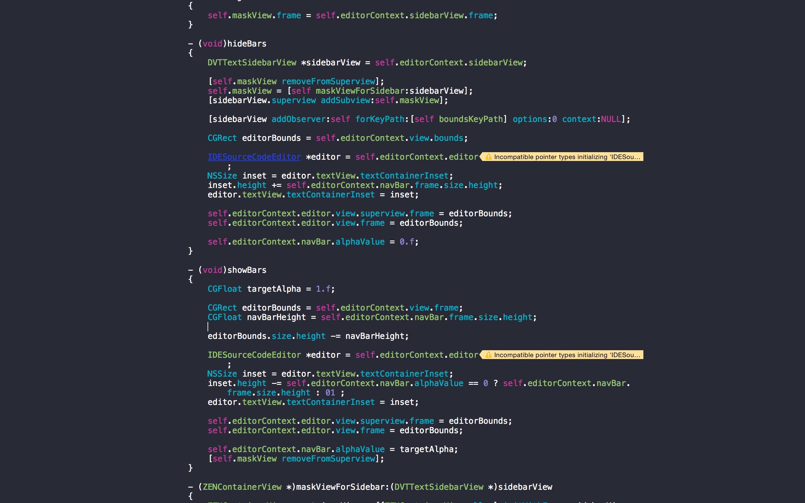

#ZEN

##Distraction free mode in Xcode

Sometimes Xcode UI is too overwhelming. Distraction free mode, whenever you just want to write code.
Works just like Xcode editor with autocompletion, cmd+click navigation, Open Quickly (cmd+shift+O) etc. 

##Using ZEN

Just go to `View->Distraction Free Mode` or use a designated shortcut (it depends on Xcode version)

##Installing 

Install via [Alcatraz](http://alcatraz.io) or clone/download ZIP and build.

##Contributing

Check out issues page for exisitng issues or create one. If you consider contributing please do pay attention to code style. You should follow the style conventions of existing code. If you are in trouble check out [NY Times' objc. ](https://github.com/NYTimes/objective-c-style-guide) This project is more or less compliant with them.

**If you create an issue please add a note about Xcode version**. Please do not duplicate issues. If you are *really* concerned about certain issue, comment it.
